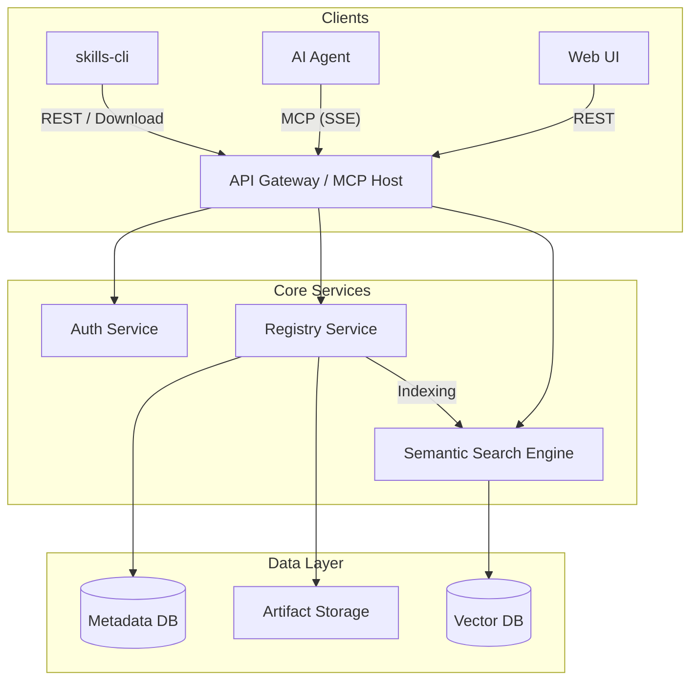

# SkillHub Registry Specification

## 1. Overview

SkillHub is a centralized registry and discovery platform for **Agent Skills**. It operates as a hybrid **MCP Server** and **HTTP REST API**, allowing both AI Agents and human users (via `skills-cli`) to search, resolve, and install skills.

It is designed to solve the discovery and versioning problem for the `skills-cli` ecosystem, moving beyond direct Git URL dependencies to a managed package model (similar to `crates.io`, `npm`, or `smithery.ai`).

## 2. Architecture



## 3. Interfaces

The server exposes two primary interfaces on the same port (e.g., `:3000`).

### 3.1. MCP Interface (Server-Sent Events)

Endpoint: `/mcp/sse`

Designed for AI Agents (Gemini, Claude, etc.) to discover skills autonomously.

#### Tools

| Tool Name | Arguments | Description |
| :--- | :--- | :--- |
| `search_skills` | `query: string` | Performs a semantic search for skills based on functionality. |
| `get_skill_details` | `name: string`, `version?: string` | Retrieves metadata, dependencies, and configuration schema. |
| `resolve_installation` | `name: string` | Returns the exact installation command or artifact URL for `skills-cli`. |

#### Resources

| URI Template | Description |
| :--- | :--- |
| `skill://{namespace}/{name}/README.md` | The human-readable documentation for the skill. |
| `skill://{namespace}/{name}/SKILL.md` | The system prompt/instructions for the skill (Agent consumption). |

### 3.2. HTTP REST Interface

Designed for `skills-cli` and Web UI.

#### Endpoints

*   **Discovery**
    *   `GET /api/v1/search?q={query}`: Text/Vector search.
    *   `GET /api/v1/skills/{namespace}/{name}`: Get skill metadata.
    *   `GET /api/v1/skills/{namespace}/{name}/versions`: List available versions.

*   **Artifacts**
    *   `GET /api/v1/download/{namespace}/{name}/{version}`: Redirects (302) to S3 pre-signed URL.

*   **Publishing**
    *   `POST /api/v1/publish`: Requires Auth. Accepts `multipart/form-data` (Manifest + Zip).

---

## 4. Data Models

### 4.1. Manifest (`skill.toml`)

Every published skill must contain this file.

```toml
[package]
name = "organization/skill-name"
version = "1.0.0"
description = "A skill to analyze SQL query performance"
license = "MIT"
authors = ["Jane Doe <jane@example.com>"]
repository = "https://github.com/org/skill-name"

[agent]
# Compatible agent environments (optional)
engines = ["gemini", "claude"] 
```

### 4.2. Database Schema (PostgreSQL)

```sql
CREATE TABLE users (
    id UUID PRIMARY KEY DEFAULT gen_random_uuid(),
    github_id VARCHAR(255) UNIQUE NOT NULL,
    username VARCHAR(255) UNIQUE NOT NULL,
    api_token_hash VARCHAR(255) NOT NULL,
    created_at TIMESTAMP WITH TIME ZONE DEFAULT NOW()
);

CREATE TABLE skills (
    id UUID PRIMARY KEY DEFAULT gen_random_uuid(),
    namespace VARCHAR(255) NOT NULL, -- e.g. "google"
    name VARCHAR(255) NOT NULL,      -- e.g. "search"
    full_name VARCHAR(511) UNIQUE GENERATED ALWAYS AS (namespace || '/' || name) STORED,
    owner_id UUID REFERENCES users(id),
    downloads BIGINT DEFAULT 0,
    created_at TIMESTAMP WITH TIME ZONE DEFAULT NOW()
);

CREATE TABLE versions (
    id UUID PRIMARY KEY DEFAULT gen_random_uuid(),
    skill_id UUID REFERENCES skills(id),
    version VARCHAR(50) NOT NULL, -- SemVer
    readme TEXT,                  -- Content of README.md
    instructions TEXT,            -- Content of SKILL.md
    artifact_s3_key VARCHAR(255) NOT NULL,
    checksum_sha256 VARCHAR(64) NOT NULL,
    created_at TIMESTAMP WITH TIME ZONE DEFAULT NOW(),
    UNIQUE(skill_id, version)
);
```

---

## 5. Workflows

### 5.1. Publishing Flow (CLI)

1.  **Developer** runs `skills login`.
    *   CLI opens browser to `https://registry.skillhub.io/login/github`.
    *   Server generates API Token and sends it back to CLI.
2.  **Developer** runs `skills publish` in their project folder.
3.  **CLI** reads `skill.toml`.
4.  **CLI** creates a ZIP archive of the directory (respecting `.gitignore`).
5.  **CLI** sends `POST /api/v1/publish` with the ZIP and Token.
6.  **Server**:
    *   Validates Token.
    *   Extracts ZIP in a sandbox.
    *   Validates `skill.toml` and `SKILL.md`.
    *   Uploads ZIP to S3 (e.g., `artifacts/google/search/1.0.0.zip`).
    *   Inserts records into DB.
    *   **Async**: Triggers embedding generation for `description` and `SKILL.md` -> Vector DB.

### 5.2. Search Flow (Agent)

1.  **Agent** calls MCP tool `search_skills(query: "help me fix rust compiler errors")`.
2.  **Server** converts query to vector embedding.
3.  **Server** queries Vector DB (e.g., Qdrant/pgvector) for nearest neighbors.
4.  **Server** returns list of skills:
    *   `rust-lang/lint-hunter` (Score: 0.95)
    *   `rust-lang/fix-my-code` (Score: 0.88)

### 5.3. Installation Flow (CLI)

1.  **User/Agent** runs `skills install rust-lang/lint-hunter`.
2.  **CLI** calls `GET /api/v1/skills/rust-lang/lint-hunter` to get metadata.
3.  **CLI** resolves "latest" to "1.2.0".
4.  **CLI** requests `GET /api/v1/download/rust-lang/lint-hunter/1.2.0`.
5.  **Server** returns 302 Redirect to S3 Signed URL.
6.  **CLI** downloads, verifies SHA256, unzips to `~/.gemini/skills/lint-hunter`.

---

## 6. Technology Stack Recommendation

*   **Language**: Rust (Shared types with `skills-cli`).
*   **Web Framework**: `Axum` (High performance, supports SSE).
*   **MCP SDK**: `mcp-rs` (or custom implementation over Axum).
*   **Database**: PostgreSQL + `pgvector`.
*   **Object Storage**: AWS S3 or MinIO.
*   **Search**: In-database vector search (pgvector) to keep stack simple initially.
